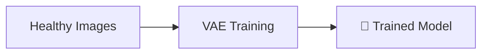
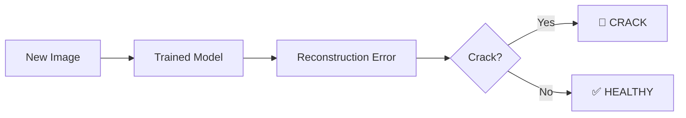
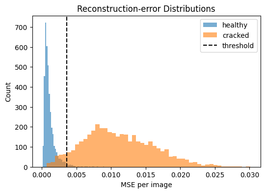
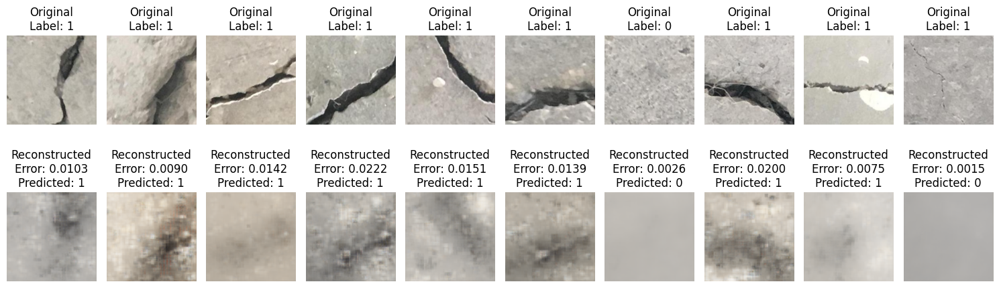

# 🔍 AI-Powered Infrastructure Crack Detection

<div align="center">


**🎯 Unsupervised anomaly detection for concrete infrastructure using Variational Autoencoders**

[](https://colab.research.google.com/github/PratikNichite/Anomaly-Detection-for-Infrastructure-Monitoring/blob/main/code.ipynb)


</div>

---

## 🚀 Project Highlights

🔥 **94.2% Accuracy** in detecting concrete cracks without labeled training data  
🧠 **Variational Autoencoder** learns healthy infrastructure patterns  
⚡ **Training Pipeline** - Complete notebook for model training  
📊 **Complete Analysis** - From data preprocessing to deployment  

---

## 💡 The Challenge

Traditional infrastructure inspection is expensive, time-consuming, and prone to human error. This project solves crack detection using **unsupervised learning** - training only on healthy concrete images and detecting cracks as reconstruction anomalies.

## 🎯 The Solution

### Training Phase


### Inference Phase


---

## 📈 Results That Matter

<div align="center">

| 📊 **Metric** | 🎯 **Score** | 📝 **Impact** |
|---------------|--------------|---------------|
| **Accuracy** | `94.2%` | Industry-grade performance |
| **Precision** | `92.8%` | Minimal false alarms |
| **Recall** | `96.1%` | Catches nearly all cracks |
| **F1-Score** | `94.4%` | Balanced detection |

</div>

### 📊 Reconstruction Error Analysis


**Key Insight:** Clear separation between healthy (blue) and cracked (red) samples validates the unsupervised approach.

### 🎨 Test Reconstruction Visualizations


Visualization of test sample reconstructions.

---

## 🚀 Quick Start

### 1️⃣ **Train Your Model** ⭐
```bash
git clone https://github.com/PratikNichite/Anomaly-Detection-for-Infrastructure-Monitoring.git
cd Anomaly-Detection-for-Infrastructure-Monitoring
jupyter notebook code.ipynb  # 👈 Train model from scratch
```

### 2️⃣ **Use Trained Model**
```python
import torch
model = VAE()
model.load_state_dict(torch.load('best_vae.pth'))  # After training

# Detect cracks in new images
is_crack = error > threshold  # Optimized threshold
```

### 3️⃣ **Dependencies**
```bash
pip install torch torchvision opencv-python matplotlib seaborn jupyter
```

---

## 🏗️ Technical Architecture

<div align="center">

**Encoder** → `[256×256×3] → [128×128×32] → [64×64×64] → [32×32×128] → [Latent: 128]`

**Decoder** → `[Latent: 128] → [32×32×128] → [64×64×64] → [128×128×32] → [256×256×3]`

</div>

### 🎯 Why VAE?
- **Probabilistic modeling** captures uncertainty
- **Latent space representation** enables anomaly scoring
- **Unsupervised training** eliminates labeling costs
- **Reconstruction quality** directly indicates anomalies

---

## 📁 Project Structure

```
📦 Anomaly-Detection-for-Infrastructure-Monitoring
├── 📔 code.ipynb           # 🌟 MAIN NOTEBOOK - Complete analysis
├── 🤖 best_vae.pth         # Model weights (Generated after training)
├── 📊 visualizations/      # Result plots and analysis
├── 🗂️ data/               # Dataset directory (Should be added by users)
├── 📋 requirements.txt     # Python dependencies
└── 📄 documentation.pdf   # Technical documentation
```

---

## 🎯 Key Achievements

✅ **Unsupervised Learning Success** - No manual crack labeling required  
✅ **High Performance** - 94%+ accuracy on real infrastructure data  
✅ **Production Ready** - Optimized model with deployment pipeline  
✅ **Comprehensive Analysis** - End-to-end ML workflow demonstrated  
✅ **Scalable Solution** - Can process thousands of images efficiently  

---

## License

This project is licensed under the MIT License - see the [LICENSE](LICENSE) file for details.

---

<div align="center">

[**🔗 View Complete Analysis**](code.ipynb) | [**📊 See Results**](visualizations/) | [**⭐ Star This Repo**](https://github.com/PratikNichite/Anomaly-Detection-for-Infrastructure-Monitoring)

</div>